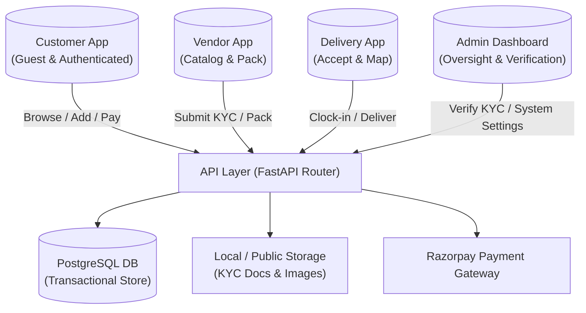
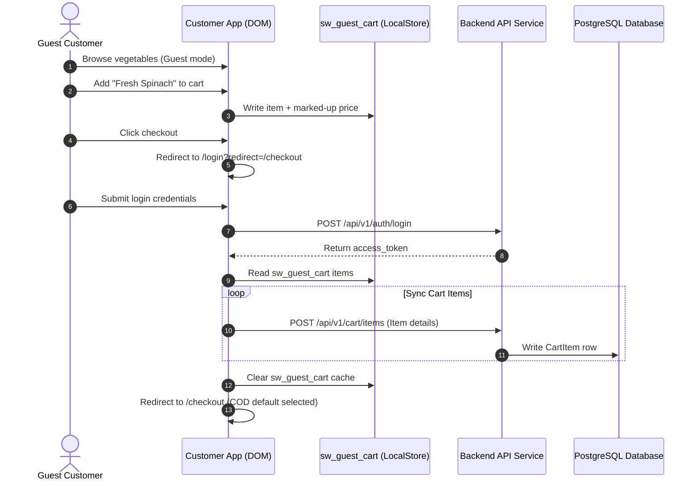
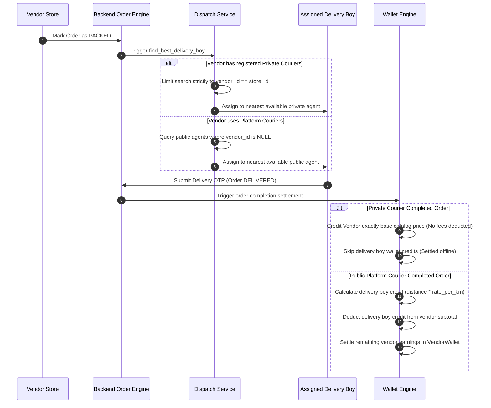

# High-Level Design (HLD) — Sbjiwala Platform Architecture

This document describes the high-level architecture, module relationships, operational workflows, and data orchestration strategies across the Sbjiwala Next.js monorepo and FastAPI backend.

---

## 1. System Context Diagram
The following context map showcases user interactions and data access pathways within the system boundary:

---

## 2. Dynamic Operational Workflows

### 2.1 unauthenticated Guest to Secure Customer Conversion
This flowchart traces how a guest browser local cart is synced upon authenticated login:

### 2.2 Smart Dispatch & Wallet Settlement Payouts
This workflow traces order pickup assignment routing, showing private vs public courier dispatch and subsequent wallet calculations:

---

## 3. Core Architectural Modules

### 3.1 Next.js 16 Web Apps Scaffold
- **`customer-app`**: Customer storefront. Enables guest browsing, features location onboarding, contextual permissions, network monitoring overlays, COD selections, and inline Razorpay modals.
- **`vendor-app`**: Store owner hub. Provides store performance metrics, inventory checklists, active order packaging buttons, and step-by-step PAN/FSSAI document KYC submission forms.
- **`delivery-app`**: Mobile courier workspace. Contains availability status toggles, task location maps, OTP confirmation verification codes, and wallet payout metrics (hidden for private agents).
- **`admin-app`**: Corporate admin console. Manages system settings (including global courier km payout rates), catalog settings, database schemas, and pending KYC verification sheets.

### 3.2 Backend Service Layers
- **Analytics Service**: Computes performance indices, aggregates sales totals, and returns metrics for vendor dashboards and admin centers.
- **Delivery Assignment Service**: Handles spatial geofencing lookups and matches dispatch requests with close couriers.
- **Order Service**: Coordinates calculations (applying marked-up prices), writes inventory audits, and dispatches completion settlements.
- **Payment Service**: Processes Razorpay standard transactions, checks payment signatures, and performs wallet transfers.
